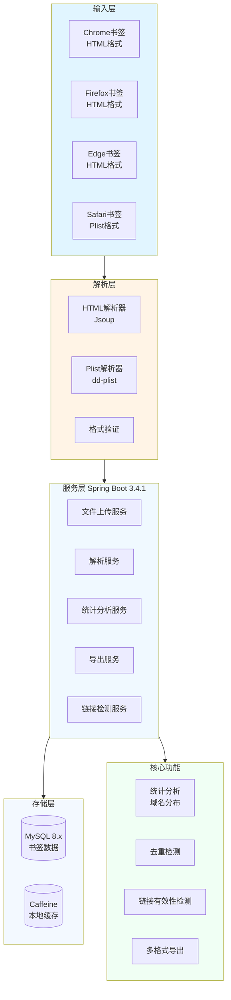

# 📚 BookMarkAnalysis - 浏览器书签解析系统


> 一个功能完整的浏览器书签解析、存储、分析和导出系统

## 📖 项目简介

BookMarkAnalysis 是一个功能完整的浏览器书签解析系统,支持 Chrome、Firefox、Edge、Safari 等主流浏览器的书签文件解析。系统提供了书签解析、存储、分析、导出等完整功能,支持 Docker 容器化部署。

## 🏗️ 系统架构



## ✨ 功能特性

| 功能 | 说明 |
|------|------|
| 🔍 **多格式解析** | 支持 HTML(Chrome/Firefox/Edge)和 plist(Safari)格式 |
| 📤 **文件上传** | 通过 API 上传书签文件并自动解析入库 |
| 📊 **统计分析** | 域名分布、重复检测、时间范围统计 |
| 🔗 **链接检测** | 同步/异步检测书签链接是否可访问 |
| 📥 **多格式导出** | 支持 HTML、Markdown、JSON 格式导出 |
| 🗂️ **书签去重** | 自动识别并处理重复书签 |
| 🐳 **Docker部署** | 一键容器化部署,开箱即用 |

## 🛠️ 技术栈

| 技术 | 版本 | 说明 |
|------|------|------|
| **Spring Boot** | 3.4.1 | Web框架 |
| **MyBatis-Plus** | 3.5.9 | ORM框架 |
| **MySQL** | 8.x | 数据库 |
| **Jsoup** | 1.18.3 | HTML解析 |
| **dd-plist** | 1.28 | Safari plist解析 |
| **Caffeine** | - | 本地缓存 |
| **springdoc-openapi** | 2.7.0 | API文档 |
| **Hutool** | 5.8.34 | 工具库 |
| **Docker** | - | 容器化部署 |

## 🚀 快速开始

### 方式一:Docker部署(推荐)

```bash
# 1. 克隆项目
git clone https://github.com/junwOpenSourceProjects/test-BookMarkAnalysis.git
cd test-BookMarkAnalysis

# 2. 复制环境变量配置
cp .env.example .env

# 3. 启动服务
docker-compose up -d

# 4. 访问应用
# API地址: http://localhost:8080
# API文档: http://localhost:8080/swagger-ui.html
```

### 方式二:本地开发

```bash
# 1. 克隆项目
git clone https://github.com/junwOpenSourceProjects/test-BookMarkAnalysis.git
cd test-BookMarkAnalysis

# 2. 创建数据库
CREATE DATABASE bookmark_analysis;

# 3. 修改配置
# 编辑 application.yml 配置数据库连接

# 4. 运行项目
mvn clean install
mvn spring-boot:run
```

## 📁 项目结构

```
test-BookMarkAnalysis/
├── src/main/java/
│   └── wo1261931780/
│       ├── controller/          # 控制器层
│       │   ├── BookmarkController.java    # 书签接口
│       │   ├── UploadController.java      # 上传接口
│       │   └── ExportController.java      # 导出接口
│       ├── service/             # 服务层
│       │   ├── BookmarkService.java       # 书签服务
│       │   ├── ParseService.java          # 解析服务
│       │   ├── AnalysisService.java       # 分析服务
│       │   └── ExportService.java         # 导出服务
│       ├── mapper/              # 数据访问层
│       ├── entity/              # 实体类
│       │   ├── Bookmark.java              # 书签实体
│       │   └── BookmarkFolder.java        # 文件夹实体
│       ├── parser/              # 解析器
│       │   ├── HtmlParser.java            # HTML解析器
│       │   └── PlistParser.java           # Plist解析器
│       ├── config/              # 配置类
│       │   ├── SwaggerConfig.java         # API文档配置
│       │   └── CacheConfig.java           # 缓存配置
│       └── utils/               # 工具类
├── src/main/resources/
│   ├── application.yml          # 配置文件
│   └── db/                      # 数据库脚本
└── docker-compose.yml           # Docker编排
```

## 🔌 API文档

启动项目后访问 OpenAPI 文档:
- Swagger UI: http://localhost:8080/swagger-ui.html
- OpenAPI JSON: http://localhost:8080/v3/api-docs

### 核心API接口

#### 1. 上传书签文件
```http
POST /api/bookmarks/upload
Content-Type: multipart/form-data

参数:
- file: 书签文件
- browser: 浏览器类型(chrome/firefox/edge/safari)

响应:
{
  "code": 200,
  "message": "上传成功",
  "data": {
    "total": 150,
    "success": 145,
    "failed": 5
  }
}
```

#### 2. 获取书签列表
```http
GET /api/bookmarks?pageNum=1&pageSize=20

响应:
{
  "code": 200,
  "data": {
    "total": 150,
    "list": [
      {
        "id": 1,
        "title": "Google",
        "url": "https://www.google.com",
        "domain": "google.com",
        "createTime": "2024-01-01"
      }
    ]
  }
}
```

#### 3. 统计分析
```http
GET /api/bookmarks/analysis

响应:
{
  "code": 200,
  "data": {
    "totalBookmarks": 150,
    "uniqueDomains": 80,
    "duplicateCount": 10,
    "domainDistribution": [
      {
        "domain": "github.com",
        "count": 20
      }
    ]
  }
}
```

#### 4. 导出书签
```http
GET /api/bookmarks/export?format=html

支持格式:
- html: HTML格式
- markdown: Markdown格式
- json: JSON格式
```

## 🔧 核心功能

### 1. 书签解析
```java
@Service
public class ParseService {
    public List<Bookmark> parseHtml(MultipartFile file) {
        Document doc = Jsoup.parse(file.getInputStream(), "UTF-8");
        // 解析书签数据
        return parseBookmarks(doc);
    }
    
    public List<Bookmark> parsePlist(MultipartFile file) {
        PropertyListParser.parse(file.getInputStream());
        // 解析Safari书签
        return parseSafariBookmarks();
    }
}
```

### 2. 统计分析
```java
@Service
public class AnalysisService {
    public Map<String, Object> analyze() {
        Map<String, Object> result = new HashMap<>();
        result.put("totalBookmarks", bookmarkMapper.selectCount(null));
        result.put("uniqueDomains", getUniqueDomains());
        result.put("duplicateCount", findDuplicates());
        result.put("domainDistribution", getDomainDistribution());
        return result;
    }
}
```

### 3. 链接检测
```java
@Service
public class CheckService {
    @Async
    public void checkLinks(List<Bookmark> bookmarks) {
        bookmarks.forEach(bookmark -> {
            try {
                HttpURLConnection conn = (HttpURLConnection) 
                    new URL(bookmark.getUrl()).openConnection();
                bookmark.setStatus(conn.getResponseCode());
                bookmarkMapper.updateById(bookmark);
            } catch (Exception e) {
                bookmark.setStatus(500);
            }
        });
    }
}
```

### 4. 多格式导出
```java
@Service
public class ExportService {
    public void exportToHtml(List<Bookmark> bookmarks, OutputStream out) {
        // 导出为HTML格式
    }
    
    public void exportToMarkdown(List<Bookmark> bookmarks, OutputStream out) {
        // 导出为Markdown格式
    }
    
    public void exportToJson(List<Bookmark> bookmarks, OutputStream out) {
        // 导出为JSON格式
    }
}
```

## 📊 数据库设计

### 书签表(bookmark)
```sql
CREATE TABLE `bookmark` (
  `id` bigint NOT NULL AUTO_INCREMENT,
  `title` varchar(255) NOT NULL COMMENT '书签标题',
  `url` varchar(500) NOT NULL COMMENT '书签URL',
  `domain` varchar(100) COMMENT '域名',
  `folder_path` varchar(255) COMMENT '文件夹路径',
  `create_time` datetime COMMENT '创建时间',
  `status` int COMMENT '状态(200/404等)',
  PRIMARY KEY (`id`),
  KEY `idx_domain` (`domain`),
  KEY `idx_url` (`url`)
);
```

## 🐳 Docker部署

### Dockerfile
```dockerfile
FROM openjdk:17-jdk-slim
WORKDIR /app
COPY target/*.jar app.jar
EXPOSE 8080
ENTRYPOINT ["java", "-jar", "app.jar"]
```

### docker-compose.yml
```yaml
version: '3.8'
services:
  app:
    build: .
    ports:
      - "8080:8080"
    environment:
      - SPRING_DATASOURCE_URL=jdbc:mysql://db:3306/bookmark
    depends_on:
      - db
  db:
    image: mysql:8.0
    environment:
      - MYSQL_ROOT_PASSWORD=root
      - MYSQL_DATABASE=bookmark
    volumes:
      - mysql_data:/var/lib/mysql
volumes:
  mysql_data:
```

## 📈 性能优化

### 1. 缓存策略
```java
@Cacheable(value = "bookmarks", key = "#domain")
public List<Bookmark> getByDomain(String domain) {
    return bookmarkMapper.selectByDomain(domain);
}
```

### 2. 异步处理
```java
@Async
public CompletableFuture<Void> checkLinksAsync(List<Bookmark> bookmarks) {
    checkLinks(bookmarks);
    return CompletableFuture.completedFuture(null);
}
```

### 3. 批量处理
```java
public void batchInsert(List<Bookmark> bookmarks) {
    bookmarkMapper.insertBatchSomeColumn(bookmarks);
}
```

## 📝 更新日志

### v1.0.0
- 初始化项目结构
- 支持Chrome/Firefox/Edge书签解析
- 支持Safari plist格式解析
- 实现统计分析功能
- 实现多格式导出
- 支持Docker部署

## 🤝 贡献指南

欢迎提交 Issue 和 Pull Request!

## 📄 许可证

本项目采用 MIT 许可证 - 查看 [LICENSE](LICENSE) 文件了解详情

## 📮 联系方式

- 作者: junw
- Email: wo1261931780@gmail.com
- GitHub: [@wo1261931780](https://github.com/wo1261931780)

## 🙏 致谢

感谢 Jsoup、dd-plist 等开源项目的支持!

---

**说明**: 本项目主要用于浏览器书签的管理和分析,支持主流浏览器格式,提供完整的解析、存储、分析和导出功能。
