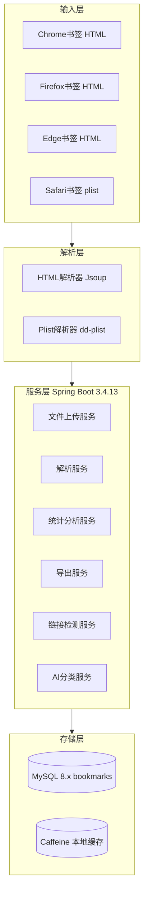

# 📚 BookMarkAnalysis - 浏览器书签解析系统


> 一个功能完整的浏览器书签解析、存储、分析、导出和管理系统。

## 📖 项目简介

BookMarkAnalysis 支持 Chrome、Firefox、Edge 导出的 HTML 书签文件以及 Safari 的 plist 书签文件解析，提供上传、存储、统计分析、链接检测、导出、去重、AI 分类和资源管理等完整能力，并支持 Docker 容器化部署。

## 🏗️ 系统架构



## AI 全量重新分类（可暂停 / 可恢复）

工具箱中的“AI 重新分类”已切换到数据库持久化的全量目录重建流程：

- 点击开始后，系统会**立即移除旧文件夹结构**，但保留所有链接书签；
- 按可注册主域名分组；不少于 5 条的域名组保留为独立目录，零散书签由 AI 跨站点聚类；
- 每个 AI 工作单元、原始响应、进度与应用结果都写入数据库；失败、服务重启或断电后任务会显示为“可恢复”，不会自动继续；
- 前端可暂停或继续任务；目录创建、书签移动和标题更新会自动、幂等地应用，无需“确认应用”。

**数据库准备：** 新安装或 Docker 初始化会使用已更新的初始化 SQL。已有 MySQL 数据库需要先执行一次：

```bash
mysql -u root -p bookmarks < sql/migrations/20260719_resumable_ai_reclassification.sql
```

新的重分类流程的 AI 密钥只从服务端环境变量 `BOOKMARK_AI_API_KEY` 读取，不会通过浏览器请求传递。

## ✨ 功能特性

| 功能 | 说明 |
|------|------|
| 🔍 **多格式解析** | 支持 HTML（Chrome/Firefox/Edge）和 plist（Safari）格式 |
| 📤 **文件上传** | 通过 API 上传书签文件并自动解析入库 |
| 📊 **统计分析** | 域名分布、重复检测、时间范围统计 |
| 📈 **仪表盘统计** | 返回总书签数、文件夹数、标签数及最近添加数 |
| 🔎 **书签搜索** | 按关键词分页搜索书签 |
| 🔗 **链接检测** | 同步/异步检测书签链接是否可访问 |
| 📥 **多格式导出** | 支持 HTML、Markdown、JSON 格式导出 |
| 🗂️ **书签去重** | 自动识别并处理重复书签 |
| 🤖 **AI 分类** | 调用大模型对书签进行智能分类 |
| 🛠️ **资源管理** | 支持节点移动、重命名、新建文件夹、批量删除 |
| 🐳 **Docker 部署** | 一键容器化部署，开箱即用 |

## 🛠️ 技术栈

| 技术 | 版本 | 说明 |
|------|------|------|
| **Spring Boot** | 3.4.13 | Web 框架 |
| **MyBatis-Plus** | 3.5.9 | ORM 框架 |
| **MySQL** | 8.x | 数据库 |
| **Jsoup** | 1.18.3 | HTML 解析 |
| **dd-plist** | 1.28 | Safari plist 解析 |
| **Caffeine** | - | 本地缓存 |
| **springdoc-openapi** | 2.7.0 | API 文档 |
| **Hutool** | 5.8.34 | 工具库 |
| **Docker** | - | 容器化部署 |

## 🚀 快速开始

### 方式一：Docker 部署（推荐）

```bash
# 1. 克隆项目
git clone https://github.com/junwOpenSourceProjects/test-BookMarkAnalysis.git
cd test-BookMarkAnalysis

# 2. 复制环境变量配置
cp .env.example .env

# 3. 启动服务
docker-compose up -d

# 4. 访问应用
# API 地址: http://localhost:8080
# API 文档: http://localhost:8080/swagger-ui.html
```

### 方式二：本地开发

```bash
# 1. 克隆项目
git clone https://github.com/junwOpenSourceProjects/test-BookMarkAnalysis.git
cd test-BookMarkAnalysis

# 2. 创建数据库
CREATE DATABASE bookmarks;

# 3. 修改配置
# 编辑 src/main/resources/application.yml 配置数据库连接

# 4. 运行项目
mvn clean install
mvn spring-boot:run

# 5. 访问应用
# API 地址: http://localhost:8000
# API 文档: http://localhost:8000/swagger-ui.html
```

## 📁 项目结构

```
test-BookMarkAnalysis/
├── src/main/java/wo1261931780/testBookMarkAnalysis/
│   ├── controller/
│   │   └── ShowMeListController.java      # 书签管理控制器
│   ├── service/
│   │   ├── BookMarksService.java
│   │   ├── BookMarks2Service.java
│   │   ├── BookmarksParserService.java
│   │   ├── LinkCheckService.java
│   │   ├── DeadLinkScannerService.java
│   │   └── impl/                          # 服务实现
│   ├── mapper/
│   │   ├── BookMarksMapper.java
│   │   └── BookMarks2Mapper.java
│   ├── entity/
│   │   ├── BaseBookmark.java              # 书签基础实体
│   │   ├── BookMarks.java                 # 原始书签实体（book_marks）
│   │   ├── BookMarks2.java                # 去重后书签实体（book_marks2）
│   │   ├── BookmarkAnalysis.java          # 统计分析 DTO
│   │   ├── ParseResult.java               # 解析结果 DTO
│   │   ├── LinkCheckResult.java           # 链接检测结果 DTO
│   │   ├── LinkCheckReport.java           # 链接检测报告 DTO
│   │   └── BookmarkColumns.java           # 列名常量
│   ├── parser/
│   │   ├── BookmarkParser.java            # 解析器接口
│   │   ├── impl/JsoupBookmarkParser.java  # Jsoup HTML 解析
│   │   └── impl/SafariBookmarkParser.java # Safari plist 解析
│   ├── config/
│   │   ├── BookmarkConfig.java
│   │   ├── CacheConfig.java
│   │   ├── CorsConfig.java
│   │   ├── MybatisPlusConfig.java
│   │   ├── MyMetaObjectHandler.java
│   │   ├── OpenApiConfig.java
│   │   └── ShowResult.java                # 统一响应体
│   ├── common/exception/
│   │   ├── GlobalExceptionHandler.java
│   │   └── BusinessException.java
│   └── TestBookMarkAnalysisApplication.java
├── src/main/resources/
│   ├── application.yml                    # 配置文件
│   └── db/                                # 数据库脚本
├── docker-compose.yml                     # Docker 编排
├── Dockerfile
├── .env.example
└── docker/mysql/init/01-init.sql          # MySQL 初始化脚本
```

## 🔌 API 文档

启动项目后访问 OpenAPI 文档：

- **本地**：http://localhost:8000/swagger-ui.html
- **Docker**：http://localhost:8080/swagger-ui.html

### 接口基础路径

所有接口均以 `/BookMarks` 为根路径，无 `/api` 前缀。

示例：`http://localhost:8000/BookMarks/list`

### 核心接口

| 方法 | 接口 | 说明 |
|------|------|------|
| GET | `/BookMarks/list?page=&limit=` | 分页书签列表 |
| GET | `/BookMarks/all` | 获取全部书签（用于树） |
| GET | `/BookMarks/analyze` | 统计分析 |
| GET | `/BookMarks/stats` | 仪表盘统计 |
| GET | `/BookMarks/search?keyword=&page=&limit=` | 搜索书签 |
| POST | `/BookMarks/upload` | 上传 HTML 书签文件 |
| POST | `/BookMarks/upload/jsoup` | Jsoup 解析上传 |
| POST | `/BookMarks/upload/safari` | Safari plist 上传 |
| POST | `/BookMarks/upload/auto` | 自动识别格式上传 |
| GET | `/BookMarks/export?format=html|markdown|json` | 导出书签 |
| GET | `/BookMarks/checkLinks?limit=` | 同步死链检测 |
| POST | `/BookMarks/checkLinks/async` | 异步死链检测 |
| GET | `/BookMarks/checkLinks/progress/{taskId}` | 查询异步检测进度 |
| POST | `/BookMarks/toolbox/reclassification/start` | 启动可暂停、可恢复的 AI 目录重建 |
| POST | `/BookMarks/toolbox/deduplicate` | 去重 |
| POST | `/BookMarks/toolbox/reset` | 清空数据 |
| POST | `/BookMarks/move` | 移动节点 |
| POST | `/BookMarks/rename` | 重命名节点 |
| POST | `/BookMarks/createFolder` | 新建文件夹 |
| POST | `/BookMarks/deleteNodes` | 批量删除节点 |

### 示例

#### 上传书签文件

```http
POST /BookMarks/upload
Content-Type: multipart/form-data

file: 书签 HTML 文件
```

#### 获取书签列表

```http
GET /BookMarks/list?page=1&limit=20
```

#### 统计分析

```http
GET /BookMarks/analyze
```

响应示例：

```json
{
  "totalCount": 150,
  "linkCount": 120,
  "folderCount": 30,
  "duplicateCount": 5,
  "domainDistribution": { "github.com": 20 },
  "duplicateUrls": ["https://example.com"],
  "earliestAddDate": 1577836800,
  "latestAddDate": 1704067200
}
```

## 📊 数据库设计

### 书签表

原始数据表 `book_marks` 与去重后数据表 `book_marks2` 字段相同：

| 字段 | 类型 | 说明 |
|------|------|------|
| `id` | bigint | 主键，雪花 ID |
| `href` | varchar(500) | 链接地址 |
| `title` | varchar(255) | 书签标题 |
| `type` | varchar(10) | 类型：`a` 链接，`h3` 文件夹 |
| `add_date` | bigint | 添加时间（Unix 时间戳） |
| `last_modified` | bigint | 最后修改时间（Unix 时间戳） |
| `parent_id` | bigint | 父级目录 ID |
| `sort_order` | int | 排序权重 |

## 🐳 Docker 部署

### docker-compose.yml

```yaml
version: '3.8'

services:
  mysql:
    image: mysql:8.0
    container_name: bookmark-mysql
    environment:
      MYSQL_ROOT_PASSWORD: ${MYSQL_ROOT_PASSWORD:-root123456}
      MYSQL_DATABASE: ${MYSQL_DATABASE:-bookmarks}
      MYSQL_USER: ${MYSQL_USER:-bookmarks}
      MYSQL_PASSWORD: ${MYSQL_PASSWORD:-bookmarks123}
    ports:
      - "${MYSQL_PORT:-3306}:3306"
    volumes:
      - mysql_data:/var/lib/mysql
      - ./docker/mysql/init:/docker-entrypoint-initdb.d:ro
    networks:
      - bookmark-network

  app:
    build:
      context: .
      dockerfile: Dockerfile
    container_name: bookmark-app
    environment:
      SPRING_DATASOURCE_URL: jdbc:mysql://mysql:3306/${MYSQL_DATABASE:-bookmarks}?useUnicode=true&characterEncoding=utf8mb4&serverTimezone=Asia/Shanghai
      SPRING_DATASOURCE_USERNAME: ${MYSQL_USER:-bookmarks}
      SPRING_DATASOURCE_PASSWORD: ${MYSQL_PASSWORD:-bookmarks123}
      SERVER_PORT: 8080
    ports:
      - "${APP_PORT:-8080}:8080"
    depends_on:
      mysql:
        condition: service_healthy
    networks:
      - bookmark-network

  redis:
    image: redis:7-alpine
    container_name: bookmark-redis
    ports:
      - "${REDIS_PORT:-6379}:6379"
    profiles:
      - redis
    networks:
      - bookmark-network

volumes:
  mysql_data:
  app_logs:
  redis_data:

networks:
  bookmark-network:
    driver: bridge
```

启动命令：

```bash
# 基础服务
docker-compose up -d

# 包含 Redis 缓存
docker-compose --profile redis up -d
```

## 📝 更新日志

### v1.0.0

- 初始化项目结构
- 支持 Chrome/Firefox/Edge HTML 书签解析
- 支持 Safari plist 格式解析
- 实现统计分析、仪表盘统计、搜索功能
- 实现多格式导出与链接检测
- 支持 AI 分类、去重和资源管理
- 支持 Docker 部署

## 📄 许可证

本项目采用 [AGPL-3.0](LICENSE) 许可证。
