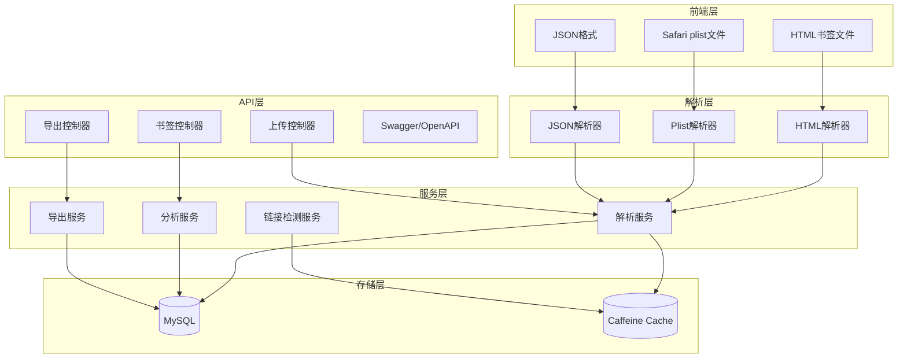

# 项目规格说明书 - test-BookMarkAnalysis

## 基本信息

| 项目名 | test-BookMarkAnalysis |
|--------|----------------------|
| 路径 | /Users/junw/Documents/GitHub/test-BookMarkAnalysis |
| 简介 | 浏览器书签解析、存储、分析和导出系统 |
| 技术栈 | Spring Boot 3.4.4 + MyBatis-Plus 3.5.9 + MySQL + Jsoup + Caffeine |
| License | AGPL-3.0 |

## 架构图



## 功能概述

- 多格式书签解析（Chrome/Firefox/Edge HTML、Safari plist）
- 书签上传、存储、统计分析
- 链接有效性检测
- 多格式导出（HTML/Markdown/JSON）
- Docker 容器化部署

## 项目结构

```
src/main/java/wo1261931780/
├── controller/     # 控制器层（Bookmark/Upload/Export）
├── service/        # 服务层（Parse/Analysis/Export/Check）
├── mapper/        # MyBatis Mapper
├── entity/        # 实体类
├── parser/        # HTML/Plist 解析器
├── config/        # Swagger/Cache 配置
└── utils/         # 工具类
```

## 数据库设计

### bookmark 表

| 字段 | 类型 | 说明 |
|------|------|------|
| id | bigint | 主键 |
| title | varchar(255) | 书签标题 |
| url | varchar(500) | 书签URL |
| domain | varchar(100) | 域名 |
| folder_path | varchar(255) | 文件夹路径 |
| create_time | datetime | 创建时间 |
| status | int | 状态码 |

## API 接口

| 接口 | 方法 | 说明 |
|------|------|------|
| /api/bookmarks/upload | POST | 上传书签文件 |
| /api/bookmarks | GET | 获取书签列表 |
| /api/bookmarks/analysis | GET | 统计分析 |
| /api/bookmarks/export | GET | 导出书签 |

## 环境要求

- JDK 25
- MySQL 8.x
- Maven 3.6+
