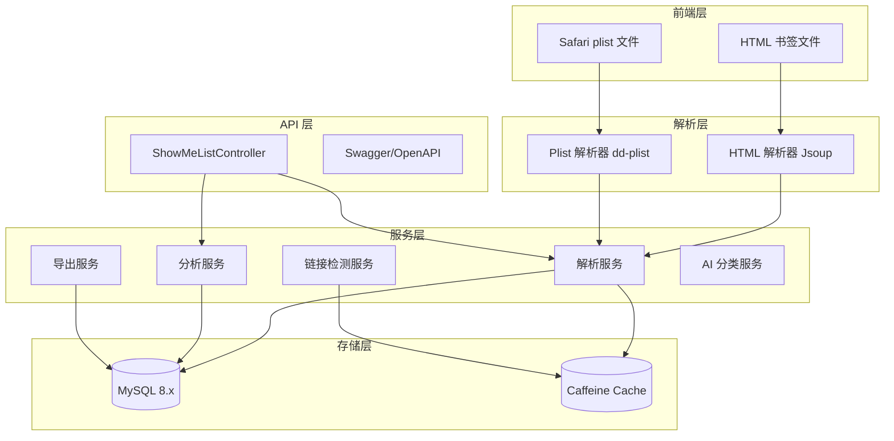

# 项目规格说明书 - test-BookMarkAnalysis

## 基本信息

| 项目名 | test-BookMarkAnalysis |
|--------|----------------------|
| 路径 | /Users/junw/Documents/GitHub/BookMarkAnalysis/test-BookMarkAnalysis |
| 简介 | 浏览器书签解析、存储、分析、导出和管理系统 |
| 技术栈 | Spring Boot 3.4.13 + MyBatis-Plus 3.5.9 + MySQL 8.x + Jsoup + Caffeine |
| License | AGPL-3.0 |

## 架构图



## 功能概述

- 多格式书签解析（Chrome/Firefox/Edge HTML、Safari plist）
- 书签上传、存储、统计分析、仪表盘统计、搜索
- 链接有效性检测（同步/异步）
- 多格式导出（HTML/Markdown/JSON）
- 书签去重、AI 分类、资源管理
- Docker 容器化部署

## 项目结构

```
src/main/java/wo1261931780/testBookMarkAnalysis/
├── controller/        # ShowMeListController
├── service/           # BookMarksService、BookmarksParserService、LinkCheckService 等
├── mapper/            # MyBatis Mapper
├── entity/            # BookMarks、BookMarks2、BaseBookmark、BookmarkAnalysis 等
├── parser/            # BookmarkParser 及 Jsoup/Safari 实现
├── config/            # OpenApiConfig、CacheConfig、BookmarkConfig 等
├── common/exception/  # GlobalExceptionHandler、BusinessException
└── TestBookMarkAnalysisApplication.java
```

## 数据库设计

### book_marks / book_marks2 表

| 字段 | 类型 | 说明 |
|------|------|------|
| `id` | bigint | 主键，雪花 ID |
| `href` | varchar(500) | 链接地址 |
| `title` | varchar(255) | 书签标题 |
| `type` | varchar(10) | 类型：`a` 链接，`h3` 文件夹 |
| `add_date` | bigint | 添加时间（Unix 时间戳） |
| `last_modified` | bigint | 最后修改时间（Unix 时间戳） |
| `parent_id` | bigint | 父级目录 ID |
| `sort_order` | int | 排序权重 |

`book_marks` 存储原始解析数据，`book_marks2` 存储去重后的链接数据。

## API 接口

所有接口根路径为 `/BookMarks`，无 `/api` 前缀。

| 方法 | 接口 | 说明 |
|------|------|------|
| GET | `/BookMarks/list?page=&limit=` | 分页书签列表 |
| GET | `/BookMarks/all` | 全部书签 |
| GET | `/BookMarks/analyze` | 统计分析 |
| GET | `/BookMarks/stats` | 仪表盘统计 |
| GET | `/BookMarks/search?keyword=&page=&limit=` | 搜索书签 |
| POST | `/BookMarks/upload` | 上传 HTML 书签文件 |
| POST | `/BookMarks/upload/jsoup` | Jsoup 解析上传 |
| POST | `/BookMarks/upload/safari` | Safari plist 上传 |
| POST | `/BookMarks/upload/auto` | 自动识别格式上传 |
| GET | `/BookMarks/export?format=html|markdown|json` | 导出书签 |
| GET | `/BookMarks/checkLinks?limit=` | 同步死链检测 |
| POST | `/BookMarks/checkLinks/async` | 异步死链检测 |
| GET | `/BookMarks/checkLinks/progress/{taskId}` | 查询异步检测进度 |
| POST | `/BookMarks/toolbox/ai/categorize` | AI 分类 |
| POST | `/BookMarks/toolbox/deduplicate` | 去重 |
| POST | `/BookMarks/toolbox/reset` | 清空数据 |
| POST | `/BookMarks/move` | 移动节点 |
| POST | `/BookMarks/rename` | 重命名节点 |
| POST | `/BookMarks/createFolder` | 新建文件夹 |
| POST | `/BookMarks/deleteNodes` | 批量删除节点 |

## 环境要求

- JDK 25
- MySQL 8.x
- Maven 3.6+
