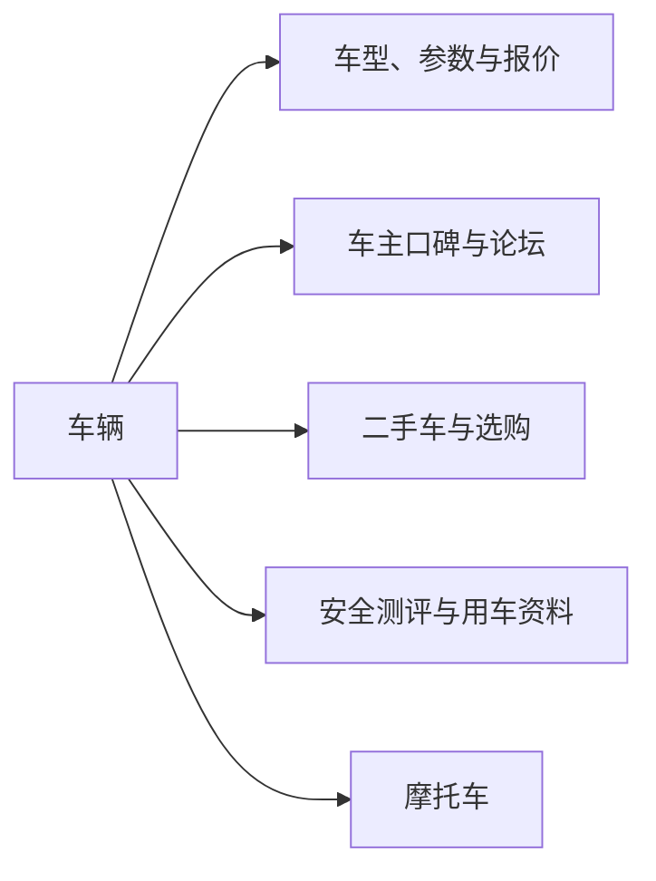
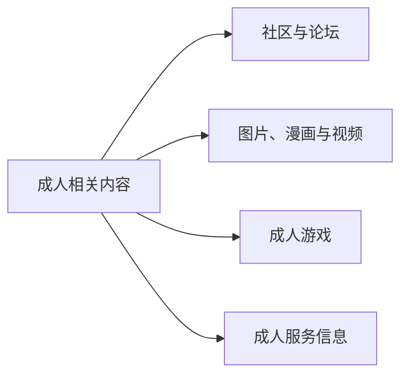

# 第四轮方案：按内容领域清晰化第三层目录（已执行）

## 这轮要解决什么

你指出的问题成立：目前不少**第三层主题目录仍然是 AI 生成的描述句**，同一领域还散落在不同的二级分支里，导致“已经分类”但“不好找”。

第四轮不再按“原文件夹名称”维持结构，而是按**稳定的内容领域**定义第三层目录。例如：

- 车型参数、车主口碑、购车参考、二手车、汽车安全测评 → **车辆**
- 成人内容与社区、成人主题论坛、成人媒体内容、成人服务信息 → **成人相关内容**

## 已执行结果（2026-07-20）

已按确认方案执行“车辆 + 成人相关内容”首批。执行范围、备份和核验详情见 [`2026-07-20-fourth-round-domain-consolidation-execution.md`](2026-07-20-fourth-round-domain-consolidation-execution.md)。

- 新建 **11** 个目标目录，迁移 **157** 条书签，清理已迁空的 **17** 个来源叶子目录。
- 书签总数保持 **7,497** 条；目录数由 **836** 变为 **830**（新增 11、删除 17）。
- 已将迁移前的来源目录、157 条书签的原父级/排序/标题/URL、以及新建目录信息写入 `bookmark_fourth_round_domain_consolidation_backup`，迁移标识为 `fourth-domain-consolidation-20260720-v1`。
- “车型参数车主口碑与二手奔驰A级选购”已按 3/2/4 条拆分到参数、口碑和二手车分支；“汽车与互动体验”的 3 条实际为车型展示/看车/购车页面，归入“车型、参数与报价”，未按草案中较保守的“安全测评”机械迁移。

## 目标架构（简版）

```mermaid
flowchart TD
    ROOT["书签"]

    ROOT --> TECH["01 技术与AI"]
    ROOT --> LEARN["02 学习与研究"]
    ROOT --> MEDIA["03 创作与娱乐"]
    ROOT --> LIFE["04 工作与生活"]
    ROOT --> FAVORITE["05 常用"]

    TECH --> TECH_AI["人工智能、模型与自动化"]
    TECH --> TECH_DEV["编程开发与开源"]
    TECH --> TECH_CLOUD["云服务、运维与网络安全"]
    TECH --> TECH_SYS["数据、硬件与系统工具"]

    LEARN --> LEARN_EDU["高校、留学与考试"]
    LEARN --> LEARN_RESEARCH["论文、科研与学科资料"]
    LEARN --> LEARN_GENERAL["阅读、语言与通识学习"]

    MEDIA --> MEDIA_DESIGN["设计、图片与视觉素材"]
    MEDIA --> MEDIA_VIDEO["视频、音频与影视"]
    MEDIA --> MEDIA_GAME["游戏、动漫与休闲"]
    MEDIA --> MEDIA_CREATE["内容创作与社交媒体"]

    LIFE --> LIFE_OFFICE["办公、效率与知识管理"]
    LIFE --> LIFE_BIZ["商业、营销与电商"]
    LIFE --> LIFE_PUBLIC["职业、政务与金融"]
    LIFE --> LIFE_DAILY["生活、出行与消费"]
    LIFE --> LIFE_WEB["网站、社区与待整理"]

    LIFE_DAILY --> VEHICLE["车辆"]
    VEHICLE --> VEHICLE_BUY["车型、参数与报价"]
    VEHICLE --> VEHICLE_OWNER["车主口碑与论坛"]
    VEHICLE --> VEHICLE_USED["二手车与选购"]
    VEHICLE --> VEHICLE_SAFE["安全测评与用车资料"]
    VEHICLE --> MOTOR["摩托车"]

    MEDIA_GAME --> ADULT["成人相关内容"]
    ADULT --> ADULT_COMMUNITY["社区与论坛"]
    ADULT --> ADULT_MEDIA["图片、漫画与视频"]
    ADULT --> ADULT_GAME["成人游戏"]
    ADULT --> ADULT_SERVICE["成人服务信息"]
```

## 本轮建议优先落地的两个领域

### 1. `04_工作与生活 / 生活、出行与消费 / 车辆`

把目前散落在多个位置的车辆内容移动到统一入口，再以第四层按用途细分：

| 当前目录 | 当前路径 | 书签数 | 建议目标 |
| --- | --- | ---: | --- |
| 购车备选车型报价对比与车主论坛参考 | 网站、社区与待整理 | 68 | `车辆 / 车主口碑与论坛` |
| 车型参数车主口碑与二手奔驰A级选购 | 网站、社区与待整理 | 9 | `车辆 / 车型、参数与报价`；其中二手车链接移至 `车辆 / 二手车与选购` |
| 汽车品牌与车型 | 商业、营销与电商 | 10 | `车辆 / 车型、参数与报价` |
| 汽车品牌与车型 | 游戏、动漫与休闲 | 3 | `车辆 / 车型、参数与报价` |
| 汽车车型资料 | 游戏、动漫与休闲 | 5 | `车辆 / 车型、参数与报价` |
| 汽车安全测评 | 云服务、运维与网络安全 | 3 | `车辆 / 安全测评与用车资料` |
| 汽车与互动体验 | 生活、出行与消费 | 3 | `车辆 / 安全测评与用车资料`（执行前逐条确认是否更适合“车主口碑”） |
| 摩托车资料与选购 | 生活、出行与消费 | 7 | `车辆 / 摩托车` |

**说明：** “车型参数车主口碑与二手奔驰A级选购”是混合目录。实际执行时应按书签 URL 和标题拆分，而不是整个目录机械搬到一个地方。

### 2. `03_创作与娱乐 / 游戏、动漫与休闲 / 成人相关内容`

成人相关内容应集中到一个明确、可折叠的主题入口，避免它们分散在“网站、社区与待整理”“视频、音频与影视”“游戏、动漫与休闲”中。

| 当前目录 | 当前路径 | 书签数 | 建议目标 |
| --- | --- | ---: | --- |
| 成人主题论坛 | 网站、社区与待整理 | 4 | `成人相关内容 / 社区与论坛` |
| 成人内容与社区 | 网站、社区与待整理 | 4 | `成人相关内容 / 社区与论坛` |
| 成人内容与敏感站点 | 网站、社区与待整理 | 4 | `成人相关内容 / 社区与论坛`（执行前逐条确认） |
| 成人媒体内容 | 网站、社区与待整理 | 4 | `成人相关内容 / 图片、漫画与视频` |
| 成人视频 | 视频、音频与影视 | 9 | `成人相关内容 / 图片、漫画与视频` |
| 成人漫画资源 | 游戏、动漫与休闲 | 3 | `成人相关内容 / 图片、漫画与视频` |
| 成人内容与敏感站点 | 游戏、动漫与休闲 | 2 | `成人相关内容 / 成人游戏` |
| 成人服务信息 | 网站、社区与待整理 | 5 | `成人相关内容 / 成人服务信息` |
| 成人本地服务信息 | 网站、社区与待整理 | 14 | `成人相关内容 / 成人服务信息` |

## 其他领域的命名原则

这一轮完成后，其余第三层目录也遵循同一个规则：

| 不推荐的第三层风格 | 推荐的第三层风格 |
| --- | --- |
| 车型参数车主口碑与二手奔驰A级选购 | 车辆 |
| 购车备选车型报价对比与车主论坛参考 | 车辆 |
| 成人内容与社区 / 成人主题论坛 | 成人相关内容 |
| 云服务与运维综合资源 | 云服务与运维（后续可再按云主机、容器、监控、网络代理细分） |
| AI 对话、助手与搜索 | AI 工具（后续可分对话、搜索、智能体） |
| 网站、社区与待整理 | 仅保留为临时收件箱；成熟主题应迁出 |

## 需要你确认

1. 是否接受把 **“车辆”** 放在 `04_工作与生活 / 生活、出行与消费` 下，并使用上述 5 个第四层分支？
2. 是否接受把所有成人相关目录收拢为 `03_创作与娱乐 / 游戏、动漫与休闲 / 成人相关内容`？
3. 是否希望我下一步将同样的方法扩展到所有第三层：先按领域定义简短目录名，再按需要建立第四层？

确认后，我会先执行“车辆 + 成人相关内容”两个领域作为第四轮首批，再生成后续领域的简版 Mermaid 架构方案。
